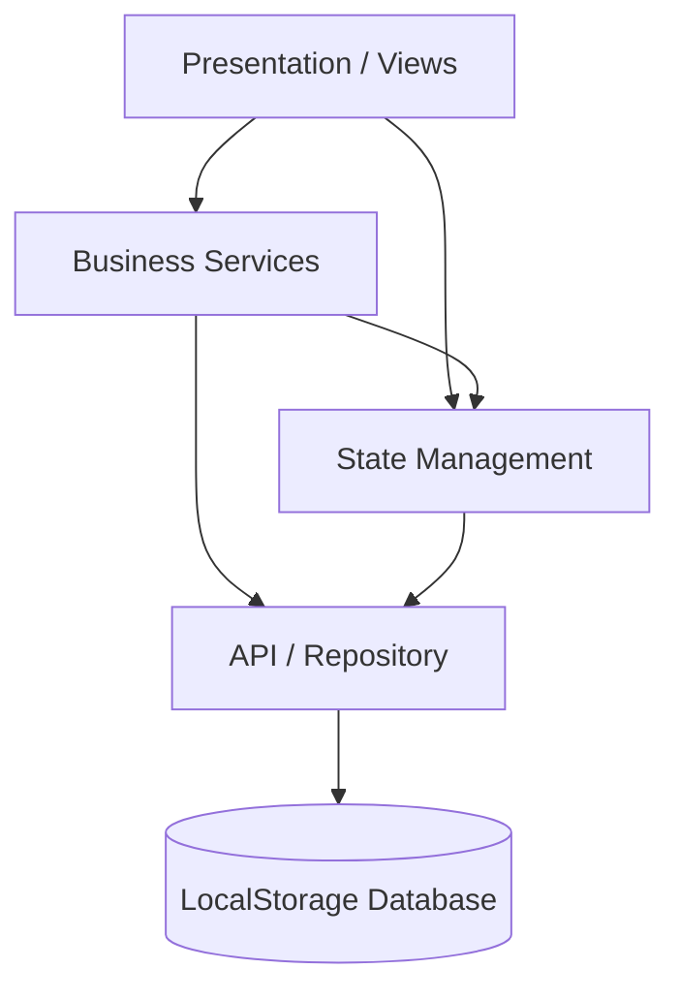
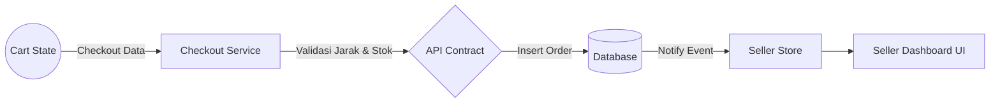
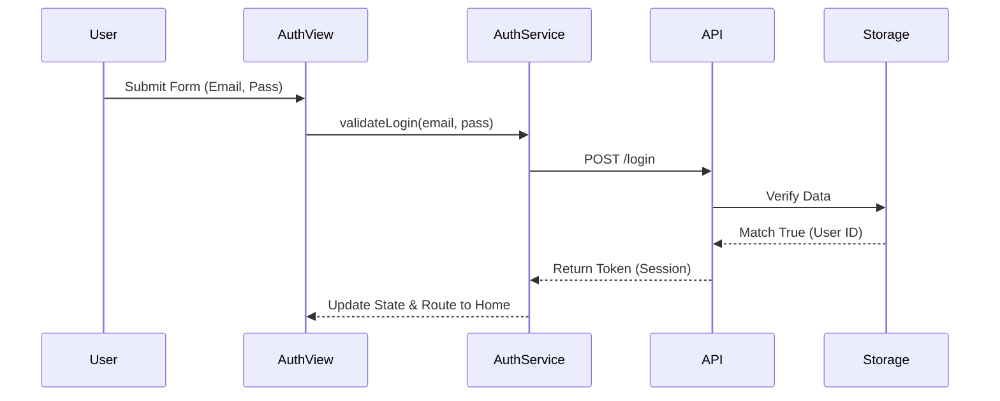
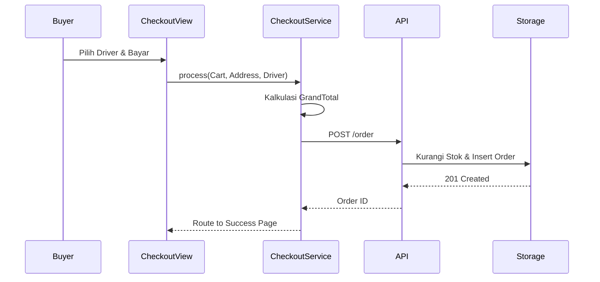
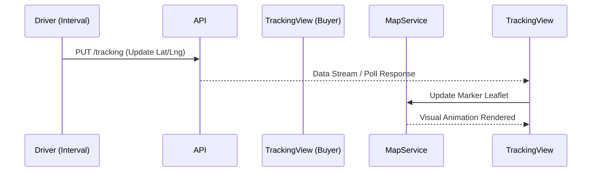

# Software Architecture Document (SAD): TitikLokal

Dokumen ini mendefinisikan arsitektur perangkat lunak TitikLokal. Arsitektur ini dirancang secara modular agar kode purwarupa ini siap dimigrasikan ke kerangka kerja modern seperti React, Vue, Flutter, atau backend Node.js/Laravel di masa depan.

---

## 1. High Level Architecture
Aplikasi SPA (*Single Page Application*) ini dirancang tanpa *backend* fisik, sehingga seluruh simulasi *Client-Server* diabstraksi secara internal.
- **Frontend (Client):** Bertanggung jawab atas UI/UX, routing DOM, State Management (Event Emitters), dan Interaksi Pengguna.
- **Mock Backend (Server-less):** Bertanggung jawab atas logika bisnis (Validasi Stok, Algoritma Jarak, Kalkulasi Harga).
- **Data Persistence (Storage):** Menyimpan *relational state* dalam format JSON di `localStorage` peramban.

---

## 2. Layer Architecture (5-Tier)
Untuk memastikan skalabilitas, kode sumber dibagi menjadi 5 lapisan tanggung jawab:
1. **Presentation Layer (Views/Components):** Mengolah input pengguna dan memanipulasi *DOM* (`js/views/`).
2. **State Layer (Store/Context):** Memegang *state* global aktif (Keranjang, Sesi) dan meneruskan notifikasi perubahan ke UI (`js/core/store.js`).
3. **Business Logic Layer (Services):** Menangani logika kompleks seperti kalkulasi total *checkout*, verifikasi *voucher*, atau algoritma jarak (`js/services/`).
4. **Repository Layer (API Contracts):** Menjembatani panggilan antara *Frontend* dan *Storage*, bertindak layaknya Axios/Fetch Client (`js/core/api.js`).
5. **Storage Layer (Database):** Manipulasi langsung dan I/O `localStorage` (`js/core/storage.js`).

---

## 3. Final Scalable Folder Structure
```text
TitikLokal/
├── css/
│   ├── styles.css              # Variabel, Grid, Utilities
│   └── components.css          # Styling spesifik komponen
├── assets/                     # Media statis (Icons, Images)
├── js/
│   ├── app.js                  # Entry point, router, global injector
│   ├── config/
│   │   ├── data.js             # Initial JSON Database Seed
│   │   └── constants.js        # Enums, Status Codes, Config
│   ├── core/
│   │   ├── api.js              # Repository Layer (Fetch Simulation)
│   │   ├── storage.js          # Storage Layer (LocalStorage IO)
│   │   ├── store.js            # State Management Layer
│   │   └── router.js           # Navigation & View Switching
│   ├── services/
│   │   ├── checkoutService.js  # Logic: Kalkulasi & Validasi
│   │   ├── mapService.js       # Logic: Leaflet JS Wrapper
│   │   └── authService.js      # Logic: Enkripsi/Sesi Dummy
│   ├── components/             # Reusable UI Library
│   │   ├── ui-library.js       # Atoms (Button, Input, Badge)
│   │   ├── cards.js            # Molecules (ProductCard, StoreCard)
│   │   └── layout.js           # Organisms (Nav, Sidebar, Header)
│   ├── views/                  # Presentation Layer
│   │   ├── auth/
│   │   ├── buyer/              # Homepage, Checkout, Profile
│   │   ├── seller/             # Dashboard, Products, Orders
│   │   └── admin/
│   └── utils/
│       ├── formatters.js       # Format Rupiah, Tanggal
│       └── validators.js       # Regex Email, Validasi Form
└── index.html                  # Root DOM Structure
```

---

## 4. Service Layer Design
Service Layer berisi fungsi statis murni (*pure functions*) yang melakukan pengolahan data sebelum/sesudah disimpan. 
Contoh: `checkoutService.calculateShipping(storeCoords, buyerCoords, providerId)` akan mereturn nilai Integer (Ongkir) tanpa menyentuh *Repository* maupun *Presentation*.

## 5. Repository Layer Design
Bertindak sebagai simulasi REST API. Semua panggilan dari *Service* atau *View* ke Repository harus bersifat asinkronus (`async/await`) untuk mensimulasikan latensi jaringan (menggunakan `setTimeout`).
Contoh: `api.post('/orders', payload)` memanggil `storage.insertOrder(payload)`.

## 6. State Management Architecture
Arsitektur menggunakan pola mirip Redux/Zustand sederhana:
- Memiliki objek *Global State* tertutup.
- Memiliki *Dispatcher/Mutator* untuk mengubah nilai.
- Memiliki pola *Observer (Pub/Sub)* sehingga komponen UI bisa melakukan `store.subscribe('cart', renderCartBadge)` yang otomatis memicu *re-render* DOM parsial.

---

## 7. API Contract (Modul)
Data dilempar menggunakan *Data Transfer Object* (DTO) baku:
- **Request:** `{ endpoint: string, method: string, payload: Object, headers: { auth: token } }`
- **Response:** `{ status: 200|400|500, message: string, data: Object|Array }`

---

## 8. Permission Matrix (RBAC)
Menerapkan *Role-Based Access Control*:

| Modul / View       | Guest | Buyer | Seller |
|--------------------|:-----:|:-----:|:------:|
| Splash / Landing   |   ✅  |   ❌  |   ❌   |
| Katalog Publik     |   ✅  |   ✅  |   ✅   |
| Checkout           |   ❌  |   ✅  |   ❌   |
| Track Order        |   ❌  |   ✅  |   ❌   |
| Add Product        |   ❌  |   ❌  |   ✅   |
| Preview Mode       |   ❌  |   ❌  |   ✅   |

---

## 9. Error Handling Strategy
- **Client Validation:** Pencegahan *input* salah menggunakan *HTML5 Required* dan `validators.js`.
- **Service/API Errors:** Melempar `throw new Error("Pesan Khusus")`.
- **Global Error Boundary:** Menangkap semua pesan *error* dan menampilkannya sebagai UI *Snackbar/Toast* berwarna merah (Error State), sehingga aplikasi tidak pernah *crash*.

---

## 10. Coding Standard
- **Paradigm:** *Functional Programming* diunggulkan ketimbang OOP.
- **Naming Convention:** *camelCase* untuk variabel/fungsi, *PascalCase* untuk class/komponen, *UPPER_SNAKE_CASE* untuk *constants*.
- **DOM Queries:** Seleksi DOM harus ditampung dalam variabel agar tidak dipanggil berulang (hindari *memory leak*).
- **Asynchronous:** Mutlak menggunakan `async/await`, hindari `.then()`.

---

## 11. Performance Strategy
- **Virtual DOM / DocumentFragment:** Merender daftar besar (seperti list 100+ UMKM) menggunakan `DocumentFragment` sebelum disuntikkan ke DOM.
- **Debounce:** Diterapkan pada fitur `Live Search` dan penggeseran Peta Leaflet untuk menghindari *lag*.
- **Lazy Loading (Images):** Semua tag `` di komponen akan diberi atribut `loading="lazy"`.

---

## 12. Security Simulation
- **Session:** Menggunakan token acak (contoh: `TL_SESSION_X82B`) di LocalStorage, bukan menyimpan *plaintext user ID*.
- **Role Protection:** File `router.js` akan mencegat (*intercept*) perpindahan View. Jika peran *Buyer* mencoba memanggil rute penjual (`view-seller-dashboard`), sistem akan mengarahkan ke halaman *Login*.

---

## 13. Navigation Architecture
Sistem menggunakan *Hash-Based Routing* (`#buyer/checkout`) atau pemanggilan internal SPA `router.navigate('view-checkout')` dengan menelusuri penumpukan *View Stack* (bisa melakukan `router.back()`).

---

## 14. Module Dependency Diagram (Mermaid)



---

## 15. Data Flow Diagram (Order Process)



---

## 16. Sequence Diagrams

### Login Flow


### Checkout Flow


### Order Tracking Flow


---

## 17. Roadmap Pengembangan TitikLokal

- **Fase 1: SPA Prototype (Current)**
  Sistem interaktif berbasis DOM vanilla dan LocalStorage. Bertujuan menguji coba UI/UX dan aliran bisnis (*Business Flow*) secara gratis kepada *Beta Testers*.
- **Fase 2: Component Migration**
  Refaktor arsitektur UI Library menjadi komponen kerangka kerja asli (React JS atau Vue JS). Logika *Service* tetap digunakan.
- **Fase 3: Backend Integration**
  Membuang modul `js/core/storage.js`. Menghubungkan lapisan Repositori (`js/core/api.js`) dengan Node.js Express / Laravel Backend melalui REST API nyata.
- **Fase 4: Database & Logistics API**
  Pemasangan PostgreSQL/MySQL. Integrasi *Payment Gateway* (Midtrans/Xendit) dan *Logistics Gateway* (Borzo/Lalamove API).
- **Fase 5: Mobile Apps (Production)**
  Kompilasi web responsif ke PWA (Progressive Web App) dan *wrapping* ke React Native/Flutter untuk rilis di Google Play Store & Apple App Store.
